---
## Front matter
lang: ru-RU
title: Лабораторная работа 4
subtitle: Операционные системы
author:
  - Наговицын А. В.
institute:
  - Российский университет дружбы народов, Москва, Россия
date: 09.03.24

## i18n babel
babel-lang: russian
babel-otherlangs: english

## Formatting pdf
toc: false
toc-title: Содержание
slide_level: 2
aspectratio: 169
section-titles: true
theme: metropolis
header-includes:
 - \metroset{progressbar=frametitle,sectionpage=progressbar,numbering=fraction}
 - '\makeatletter'
 - '\beamer@ignorenonframefalse'
 - '\makeatother'
---
# Информация

## Докладчик

:::::::::::::: {.columns align=center}
::: {.column width="70%"}

  * Наговицын А. В.
  * Студент, 1 курс, группа НКАбд-04-23
  * Российский университет дружбы народов
  * [1132239111@pfur.ru]
  * <https://github.com/AVNagov>

:::
::: {.column width="30%"}

:::
::::::::::::::

# Вводная часть

## Цель работы

Целью данной лабораторной работы является получение навыков правильной работы с репозиториями git.

## Задание

1. Установка и настройка программного обеспечения.
2. Настройка общепринятых коммитов.

## Теоретическое введение

Рабочий процесс Gitflow

    Рабочий процесс Gitflow Workflow. Будем описывать его с использованием пакета 
    git-flow.

Общая информация

    Gitflow Workflow опубликована и популяризована Винсентом Дриссеном.
    Создадим ветку для новой функциональности
    Gitflow Workflow предполагает выстраивание строгой модели ветвления 
    с учётом выпуска проекта.
    Данная модель отлично подходит для организации рабочего процесса 
    на основе релизов.
    Работа по модели Gitflow включает создание отдельной ветки
    для исправлений ошибок в рабочей среде.
    
## Теоретическое введение
    
    Последовательность действий при работе по модели Gitflow:
        Из ветки master создаётся ветка develop.
        Из ветки develop создаётся ветка release.
        Из ветки develop создаются ветки feature.
        Когда работа над веткой feature завершена, 
        она сливается с веткой develop.
        Когда работа над веткой релиза release завершена,
        она сливается в ветки develop и master.
        Если в master обнаружена проблема,
        из master создаётся ветка hotfix.
        Когда работа над веткой исправления hotfix завершена, 
        она сливается в ветки develop и master.

# Выполнение лабораторной работы

## Установка программного обеспечения.

Включаю корпоративный репозиторий командой.

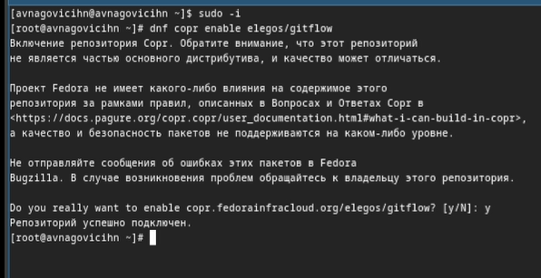{#fig:001 width=70%}

## Установка программного обеспечения.

Устанавливаю git-flow. Для этого перехожу на роль супер-пользователя и прописываю команду.

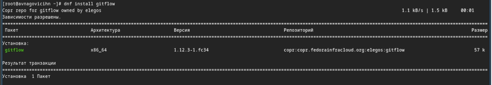{#fig:002 width=70%}

## Установка программного обеспечения.

Перехожу к установке nodejs. Для этого прописываю команду.

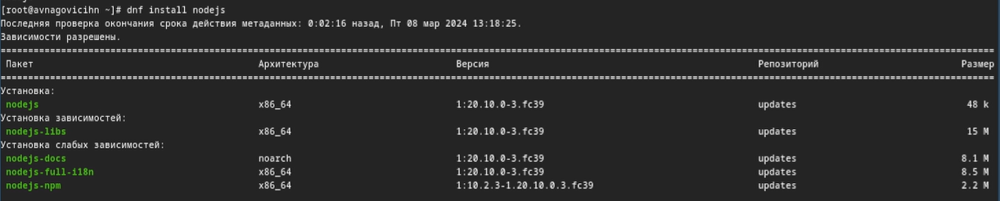{#fig:003 width=70%}

## Установка программного обеспечения.

Проверяю корректность установки пакетов команды pnpm.

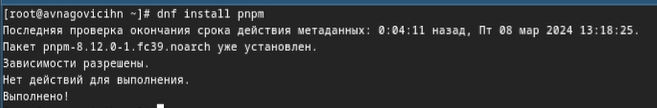{#fig:004 width=70%}

## Установка программного обеспечения.

Перехожу к настройке nodejs. Добавляю каталог с исполняемыми файлами, устанавливаемыми yarn, в переменную PATH.

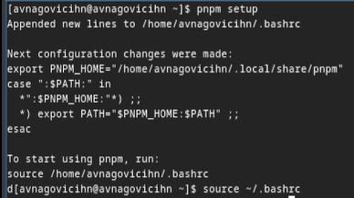{#fig:005 width=70%}

## Настройка общепринятых коммитов.

Устанавливаю программу, которая используется для помощи в форматировании коммитов.

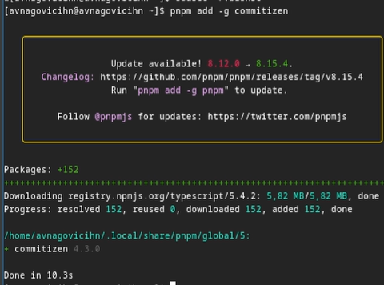{#fig:006 width=70%}

## Настройка общепринятых коммитов.

Далее Устанавливаю программу, которая используется для помощи в создании логов.

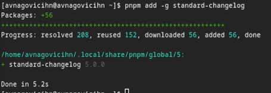{#fig:007 width=70%}

## Настройка общепринятых коммитов.

Создаю репозиторий на github.

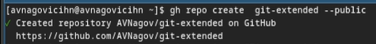{#fig:008 width=70%}

## Настройка общепринятых коммитов.

Копирую репозиторий себе на виртуальную машину, после чего перехожу в каталог.

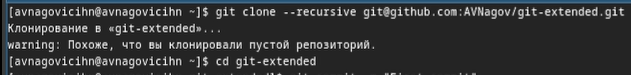{#fig:009 width=70%}

## Настройка общепринятых коммитов.

Создаю первый коммит и выкладываю на github.

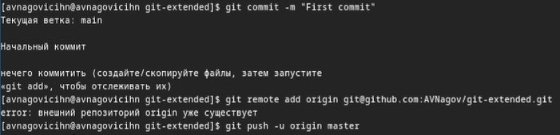{#fig:010 width=70%}

## Настройка общепринятых коммитов.

Перехожу к конфигурации общепринятых коммитов.

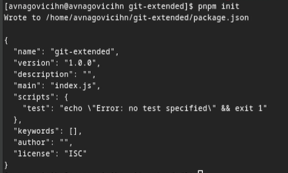{#fig:011 width=70%}

## Настройка общепринятых коммитов.

Теперь перехожу к редактированию файла package.json.

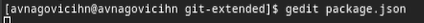{#fig:012 width=70%}

## Настройка общепринятых коммитов.

Редактирую файл.

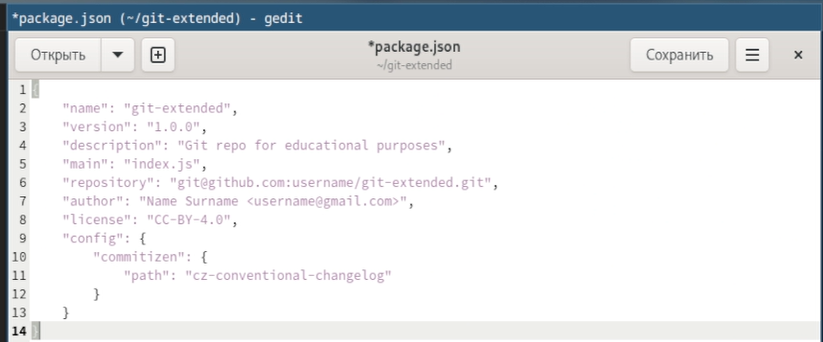{#fig:013 width=70%}

## Настройка общепринятых коммитов.

Отправляю все github.

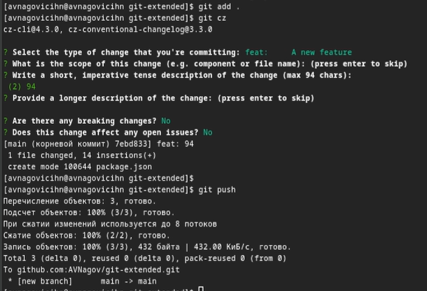{#fig:014 width=70%}

## Настройка общепринятых коммитов.

Инициализируею git-flow.

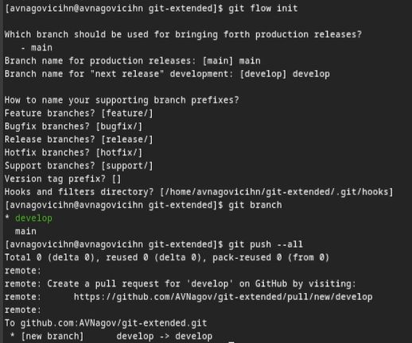{#fig:015 width=70%}

## Настройка общепринятых коммитов.

Проверяю, что нахожусь на ветке develop и загружаю весь репозиторий в хранилище.

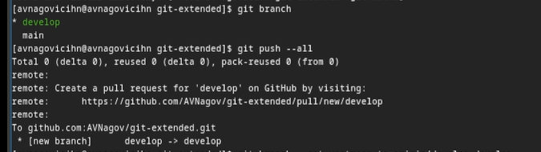{#fig:016 width=70%}

## Настройка общепринятых коммитов.

Устанавливаю внешнюю ветку как вышестоящую для этой ветки и создадаю релиз с версией 1.0.0.

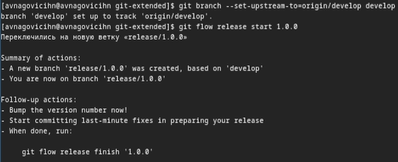{#fig:017 width=70%}

## Настройка общепринятых коммитов.

Создаю журнал изменений и добавляю журнал изменений в индекс.

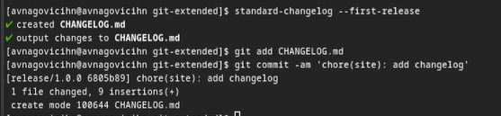{#fig:018 width=70%}

## Настройка общепринятых коммитов.

Добавляю журнал изменений в индекс.

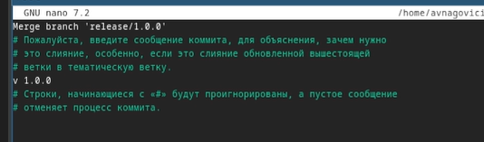{#fig:019 width=70%}

## Настройка общепринятых коммитов.

Добавляю журнал изменений в индекс.

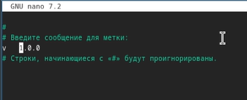{#fig:020 width=70%}

## Настройка общепринятых коммитов.

Добавляю журнал изменений в индекс.

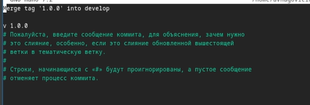{#fig:021 width=70%}

## Настройка общепринятых коммитов.

Загружаю релизную ветку в основную ветку и отправляю данные на github.

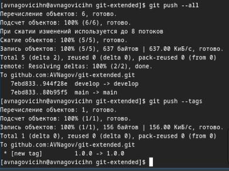{#fig:021 width=70%}

## Настройка общепринятых коммитов.

Создаю релиз на github.

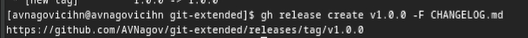{#fig:023 width=70%}

## Настройка общепринятых коммитов.

Создаю ветку для новой функциональности и объединяю ветку feature_branch c develop.

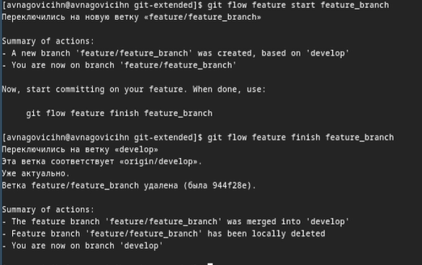{#fig:024 width=70%}

## Настройка общепринятых коммитов.

Создаю релиз с версией 1.2.3.

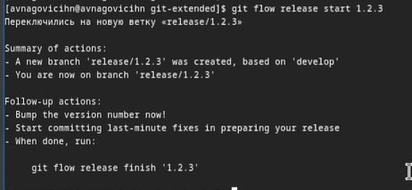{#fig:025 width=70%}

## Настройка общепринятых коммитов.

Обновляю номер версии в файле package.json.

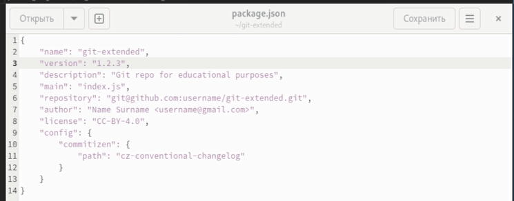{#fig:026 width=70%}

## Настройка общепринятых коммитов.

Создаю журнал изменений и добавляю журнал изменений в индекс.

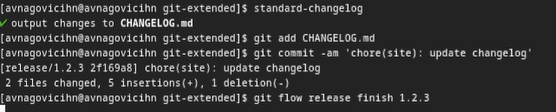{#fig:027 width=70%}

## Настройка общепринятых коммитов.

Добавляю журнал изменений в индекс.

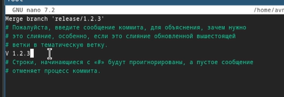{#fig:028 width=70%}

## Настройка общепринятых коммитов.

Добавляю журнал изменений в индекс.

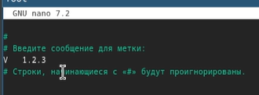{#fig:029 width=70%}

## Настройка общепринятых коммитов.

Добавляю журнал изменений в индекс.

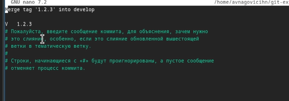{#fig:030 width=70%}

## Настройка общепринятых коммитов.

Загружаю релизную ветку в основную ветку и отправляю данные на github.

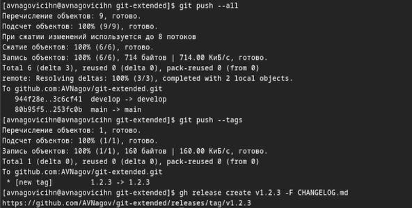{#fig:031 width=70%}

## Настройка общепринятых коммитов.

Проверяю правильность выполнения команды.

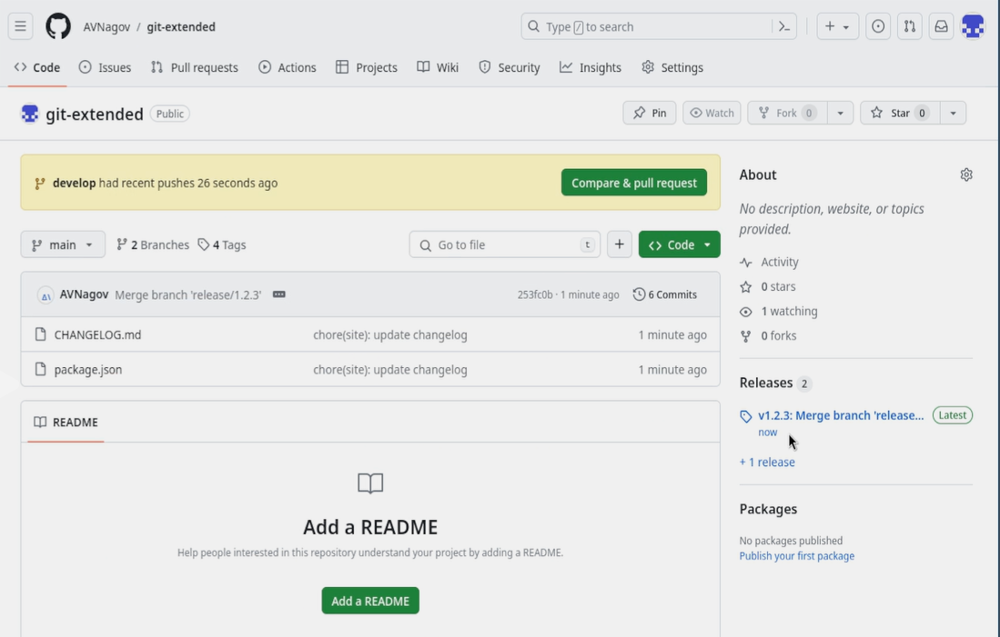{#fig:032 width=70%}

# Выводы

При выполнение данной лабораторной работы я приобрел практические навыки правильной работы с репозиториями git.

