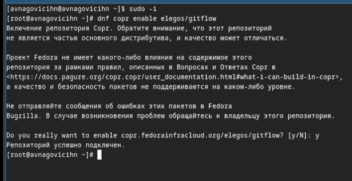
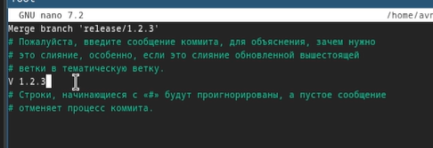

---
## Front matter
title: "Лабораторная работа №4"
subtitle: "Операционные системы"
author: "Наговицын Арсений Владимирович"

## Generic otions
lang: ru-RU
toc-title: "Содержание"

## Bibliography
bibliography: bib/cite.bib
csl: pandoc/csl/gost-r-7-0-5-2008-numeric.csl

## Pdf output format
toc: true # Table of contents
toc-depth: 2
lof: true # List of figures
lot: true # List of tables
fontsize: 12pt
linestretch: 1.5
papersize: a4
documentclass: scrreprt
## I18n polyglossia
polyglossia-lang:
  name: russian
  options:
	- spelling=modern
	- babelshorthands=true
polyglossia-otherlangs:
  name: english
## I18n babel
babel-lang: russian
babel-otherlangs: english
## Fonts
mainfont: PT Serif
romanfont: PT Serif
sansfont: PT Sans
monofont: PT Mono
mainfontoptions: Ligatures=TeX
romanfontoptions: Ligatures=TeX
sansfontoptions: Ligatures=TeX,Scale=MatchLowercase
monofontoptions: Scale=MatchLowercase,Scale=0.9
## Biblatex
biblatex: true
biblio-style: "gost-numeric"
biblatexoptions:
  - parentracker=true
  - backend=biber
  - hyperref=auto
  - language=auto
  - autolang=other*
  - citestyle=gost-numeric
## Pandoc-crossref LaTeX customization
figureTitle: "Рис."
tableTitle: "Таблица"
listingTitle: "Листинг"
lofTitle: "Список иллюстраций"
lotTitle: "Список таблиц"
lolTitle: "Листинги"
## Misc options
indent: true
header-includes:
  - \usepackage{indentfirst}
  - \usepackage{float} # keep figures where there are in the text
  - \floatplacement{figure}{H} # keep figures where there are in the text
---

# Цель работы

Получение навыков правильной работы с репозиториями git.

# Задание

1. Установка и настройка программного обеспечения.
2. Настройка общепринятых коммитов.

# Теоретическое введение

Рабочий процесс Gitflow

    Рабочий процесс Gitflow Workflow. Будем описывать его с использованием пакета git-flow.

Общая информация

    Gitflow Workflow опубликована и популяризована Винсентом Дриссеном.Создадим ветку для новой функциональности
    Gitflow Workflow предполагает выстраивание строгой модели ветвления с учётом выпуска проекта.
    Данная модель отлично подходит для организации рабочего процесса на основе релизов.
    Работа по модели Gitflow включает создание отдельной ветки для исправлений ошибок в рабочей среде.
    Последовательность действий при работе по модели Gitflow:
        Из ветки master создаётся ветка develop.
        Из ветки develop создаётся ветка release.
        Из ветки develop создаются ветки feature.
        Когда работа над веткой feature завершена, она сливается с веткой develop.
        Когда работа над веткой релиза release завершена, она сливается в ветки develop и master.
        Если в master обнаружена проблема, из master создаётся ветка hotfix.
        Когда работа над веткой исправления hotfix завершена, она сливается в ветки develop и master.
        

# Выполнение лабораторной работы

## Установка программного обеспечения.

Включаю корпоративный репозиторий командой(рис. @fig:001).

{#fig:001 width=70%}

Устанавливаю git-flow. Для этого перехожу на роль супер-пользователя и прописываю команду(рис. @fig:002).

{#fig:002 width=70%}

Перехожу к установке nodejs. Для этого прописываю команду (рис. @fig:003).

{#fig:003 width=70%}

Проверяю корректность установки пакетов команды pnpm.(рис. @fig:004).

{#fig:004 width=70%}

Перехожу к настройке nodejs. Добавляю каталог с исполняемыми файлами, устанавливаемыми yarn, в переменную PATH.(рис. @fig:005).

{#fig:005 width=70%}

## Настройка общепринятых коммитов.

Устанавливаю программу, которая используется для помощи в форматировании коммитов (рис. @fig:006).

{#fig:006 width=70%}

Далее Устанавливаю программу, которая используется для помощи в создании логов (рис. @fig:007).

{#fig:007 width=70%}

Создаю репозиторий на github (рис. @fig:007).

{#fig:008 width=70%}

Копирую репозиторий себе на виртуальную машину, после чего перехожу в каталог.(рис. @fig:009).

{#fig:009 width=70%}

Создаю первый коммит и выкладываю на github (рис. @fig:010).

{#fig:010 width=70%}

Перехожу к конфигурации общепринятых коммитов (рис. @fig:011).

{#fig:011 width=70%}

Теперь перехожу к редактированию файла package.json (рис. @fig:012).

{#fig:012 width=70%}

Редактирую файл (рис. @fig:013).

{#fig:013 width=70%}

Отправляю все github (рис. @fig:014).

{#fig:014 width=70%}

Инициализируею git-flow (рис. @fig:015).

{#fig:015 width=70%}

Проверяю, что нахожусь на ветке develop и загружаю весь репозиторий в хранилище (рис. @fig:016).

{#fig:016 width=70%}

Устанавливаю внешнюю ветку как вышестоящую для этой ветки и создадаю релиз с версией 1.0.0 (рис. @fig:017).

{#fig:017 width=70%}

Создаю журнал изменений и добавляю журнал изменений в индекс (рис. @fig:018).

{#fig:018 width=70%}

Добавляю журнал изменений в индекс (рис. @fig:019).

{#fig:019 width=70%}

Добавляю журнал изменений в индекс (рис. @fig:020).

{#fig:020 width=70%}

Добавляю журнал изменений в индекс (рис. @fig:021).

{#fig:021 width=70%}

Загружаю релизную ветку в основную ветку и отправляю данные на github (рис. @fig:022).

{#fig:021 width=70%}

Создаю релиз на github (рис. @fig:023).

{#fig:023 width=70%}

Создаю ветку для новой функциональности и объединяю ветку feature_branch c develop (рис. @fig:024).

{#fig:024 width=70%}

Создаю релиз с версией 1.2.3 (рис. @fig:025).

{#fig:025 width=70%}

Обновляю номер версии в файле package.json (рис. @fig:026).

{#fig:026 width=70%}

Создаю журнал изменений и добавляю журнал изменений в индекс (рис. @fig:027).

{#fig:027 width=70%}

Добавляю журнал изменений в индекс (рис. @fig:028).

{#fig:028 width=70%}

Добавляю журнал изменений в индекс (рис. @fig:029).

{#fig:029 width=70%}

Добавляю журнал изменений в индекс (рис. @fig:030).

{#fig:030 width=70%}

Загружаю релизную ветку в основную ветку и отправляю данные на github (рис. @fig:031).

{#fig:031 width=70%}

Проверяю правильность выполнения команды  (рис. @fig:032).

{#fig:032 width=70%}

# Выводы

При выполнение данной лабораторной работы я приобрел практические навыки правильной работы с репозиториями git.

