---
## Front matter
lang: ru-RU
title: Лабораторная работа №5
subtitle: Операционные системы
author:
  - Наговицын А. В.
institute:
  - Российский университет дружбы народов, Москва, Россия
date: 09.03.24

## i18n babel
babel-lang: russian
babel-otherlangs: english

## Formatting pdf
toc: false
toc-title: Содержание
slide_level: 2
aspectratio: 169
section-titles: true
theme: metropolis
header-includes:
 - \metroset{progressbar=frametitle,sectionpage=progressbar,numbering=fraction}
 - '\makeatletter'
 - '\beamer@ignorenonframefalse'
 - '\makeatother'
---
# Информация

## Докладчик

:::::::::::::: {.columns align=center}
::: {.column width="70%"}

  * Наговицын А. В.
  * Студент, 1 курс, группа НКАбд-04-23
  * Российский университет дружбы народов
  * [1132239111@pfur.ru]
  * <https://github.com/AVNagov>

:::
::: {.column width="30%"}

:::
::::::::::::::

# Вводная часть

## Цель работы

Целью данной лабораторной работы является получение навыков настройки рабочей среды.

# Выполнение лабораторной работы

## Установка и настройка менеджера паролей pass.

Устанавливаю pass.

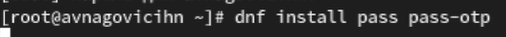{#fig:001 width=70%}

## Установка и настройка менеджера паролей pass.

Устанавливаю go-pass.

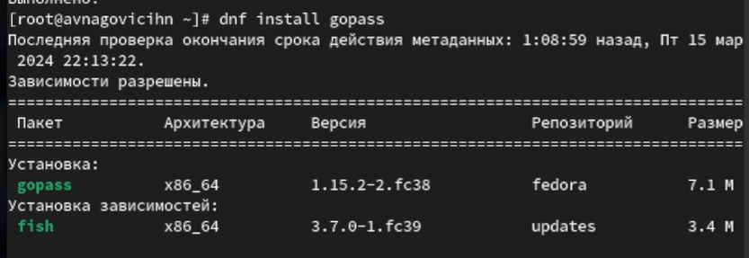{#fig:002 width=70%}

## Установка и настройка менеджера паролей pass.

Перехожу к настройке. Просматриваю список ключей gpg.

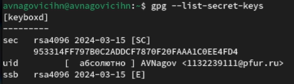{#fig:003 width=70%}

## Установка и настройка менеджера паролей pass.

Так как ключ есть, перехожу к инициализации хранилища. Также создаю структуру git.

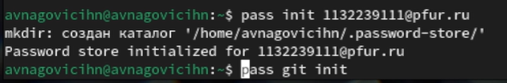{#fig:004 width=70%}

## Установка и настройка менеджера паролей pass.

Заранее создав репозиторий, задаю адрес репозитория. Также синхронизирую с git.

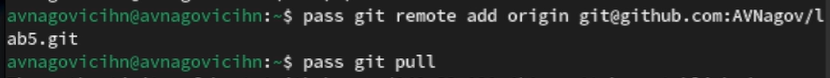{#fig:005 width=70%}

## Установка и настройка менеджера паролей pass.

Cинхронизирую с git.

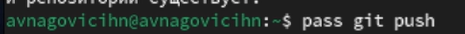{#fig:006 width=70%}

## Установка и настройка менеджера паролей pass.

Перехожу к прямым изменениям и выкладываю на github.

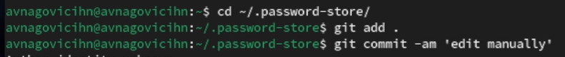{#fig:007 width=70%}

## Установка и настройка менеджера паролей pass.

Выкладываю на github.

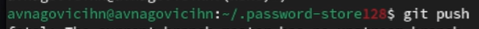{#fig:008 width=70%}

## Установка и настройка менеджера паролей pass.

Проверяю статус синхронизации.

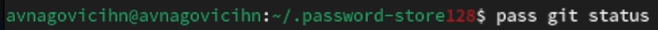{#fig:009 width=70%}

## Настройка интерфейса с броузером.

Перейдя на официальный сайт плагина, установил его.

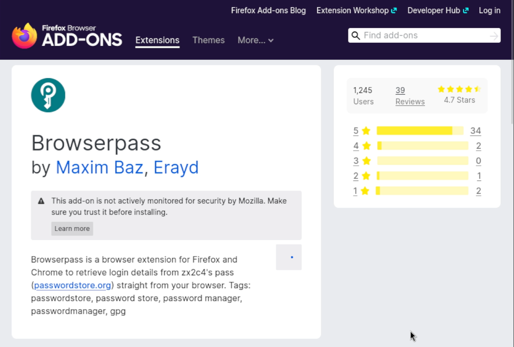{#fig:010 width=70%}

## Настройка интерфейса с броузером.

Устанавливаю интерфейс для взаимодействия с броузером.

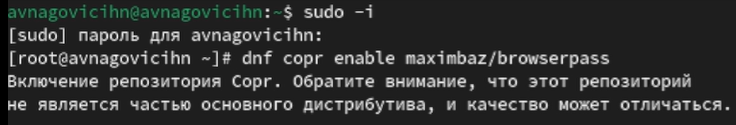{#fig:011 width=70%}

## Настройка интерфейса с броузером.

Устанавливаю browserpass.

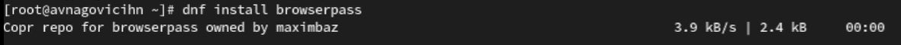{#fig:012 width=70%}

## Сохранение пароля.

Добавляю новый пароль.

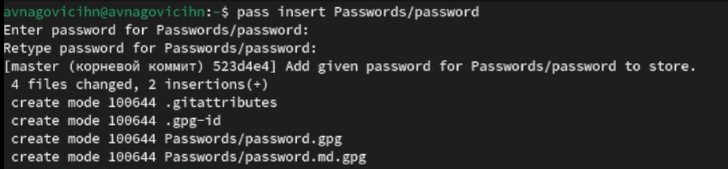{#fig:013 width=70%}

## Сохранение пароля.

Заменяю существующий пароль.

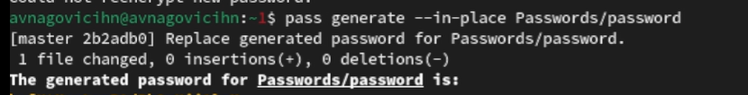{#fig:014 width=70%}

## Управление файлами конфигурации.

Устанавливаю дополнительное ПО.

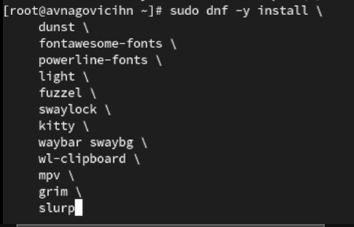{#fig:015 width=70%}

## Управление файлами конфигурации.

Устанавливаю Шрифты.

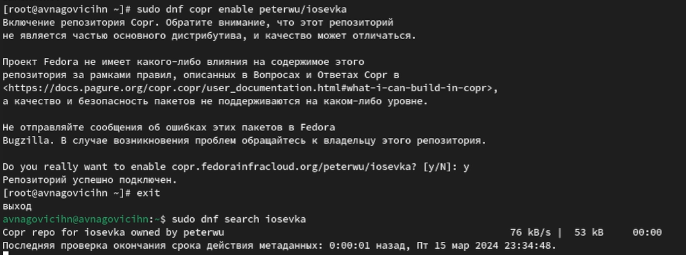{#fig:016 width=70%}

## Управление файлами конфигурации.

Устанавливаю Шрифты.

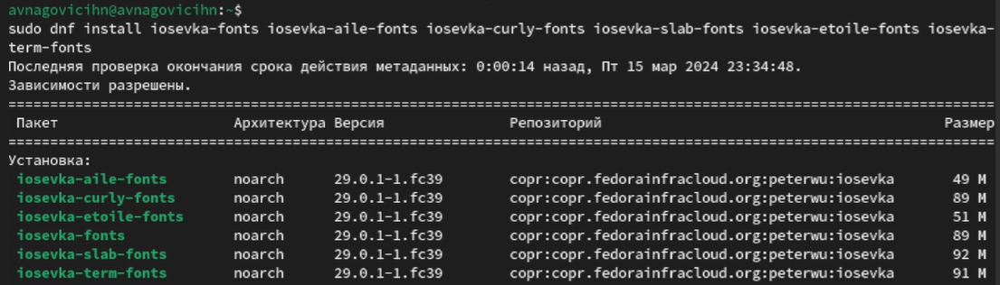{#fig:017 width=70%}

## Управление файлами конфигурации.

Установка бинарного файла.

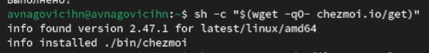{#fig:018 width=70%}

## Управление файлами конфигурации.

Создаю собственный репозиторий с помощью утилит.

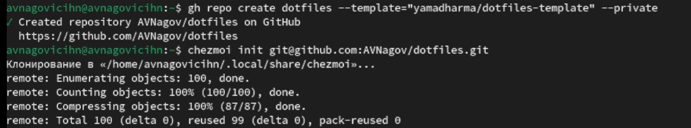{#fig:019 width=70%}

## Ежедневные операции c chezmoi

Извлекаю последние изменения из репозитория и применяю их.

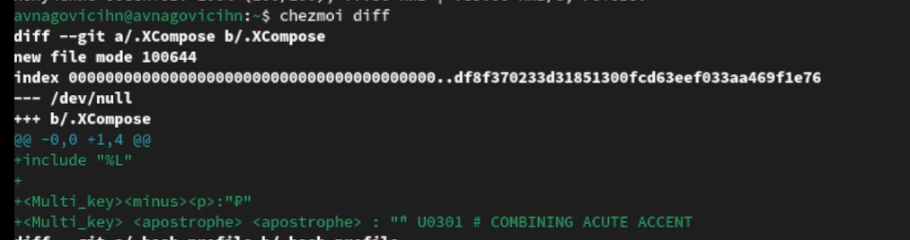{#fig:020 width=70%}

## Ежедневные операции c chezmoi

Применяю изменения.

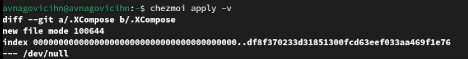{#fig:021 width=70%}

## Ежедневные операции c chezmoi

Для того чтобы включить функцию, которая автоматически фиксирует и отправляет изменения в исходный каталог, редактирую файл.

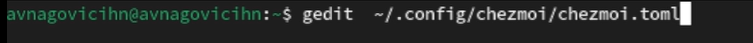{#fig:022 width=70%}

## Ежедневные операции c chezmoi

Редактирую файл.

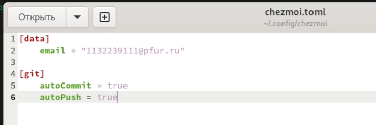{#fig:023 width=70%}

# Выводы

При выполнение данной лабораторной работы я приобрел практические навыки настройки рабочей среды.

