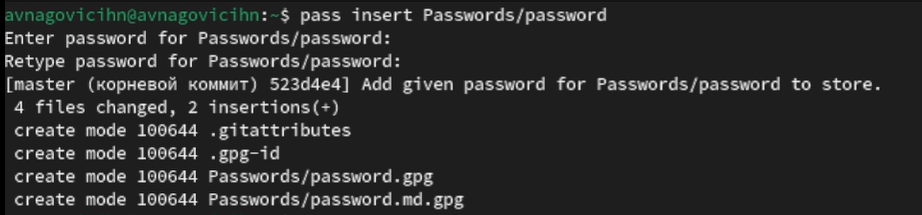

---
## Front matter
title: "Лабораторная работа №5"
subtitle: "Операционные системы"
author: "Наговицын Арсений Владимирович"

## Generic otions
lang: ru-RU
toc-title: "Содержание"

## Bibliography
bibliography: bib/cite.bib
csl: pandoc/csl/gost-r-7-0-5-2008-numeric.csl

## Pdf output format
toc: true # Table of contents
toc-depth: 2
lof: true # List of figures
lot: true # List of tables
fontsize: 12pt
linestretch: 1.5
papersize: a4
documentclass: scrreprt
## I18n polyglossia
polyglossia-lang:
  name: russian
  options:
	- spelling=modern
	- babelshorthands=true
polyglossia-otherlangs:
  name: english
## I18n babel
babel-lang: russian
babel-otherlangs: english
## Fonts
mainfont: PT Serif
romanfont: PT Serif
sansfont: PT Sans
monofont: PT Mono
mainfontoptions: Ligatures=TeX
romanfontoptions: Ligatures=TeX
sansfontoptions: Ligatures=TeX,Scale=MatchLowercase
monofontoptions: Scale=MatchLowercase,Scale=0.9
## Biblatex
biblatex: true
biblio-style: "gost-numeric"
biblatexoptions:
  - parentracker=true
  - backend=biber
  - hyperref=auto
  - language=auto
  - autolang=other*
  - citestyle=gost-numeric
## Pandoc-crossref LaTeX customization
figureTitle: "Рис."
tableTitle: "Таблица"
listingTitle: "Листинг"
lofTitle: "Список иллюстраций"
lotTitle: "Список таблиц"
lolTitle: "Листинги"
## Misc options
indent: true
header-includes:
  - \usepackage{indentfirst}
  - \usepackage{float} # keep figures where there are in the text
  - \floatplacement{figure}{H} # keep figures where there are in the text
---

# Цель работы

Целью данной лабораторной работы является получение навыков настройки рабочей среды.

# Задание

1. Установка и настройка менеджера паролей pass.
2. Настройка интерфейса с броузером. 
3. Сохранение пароля.
4. Управление файлами конфигурации.
5. Ежедневные операции c chezmoi

# Выполнение лабораторной работы

## Установка и настройка менеджера паролей pass.

Устанавливаю pass (рис. @fig:001).

{#fig:001 width=70%}

Устанавливаю go-pass (рис. @fig:002).

{#fig:002 width=70%}

Перехожу к настройке. Просматриваю список ключей gpg (рис. @fig:003).

{#fig:003 width=70%}

Так как ключ есть, перехожу к инициализации хранилища. Также создаю структуру git (рис. @fig:004).

{#fig:004 width=70%}

Заранее создав репозиторий, задаю адрес репозитория. Также синхронизирую с git(рис. @fig:005).

{#fig:005 width=70%}

Cинхронизирую с git(рис. @fig:006).

{#fig:006 width=70%}

Перехожу к прямым изменениям и выкладываю на github(рис. @fig:007).

{#fig:007 width=70%}

Выкладываю на github(рис. @fig:008).

{#fig:008 width=70%}

Проверяю статус синхронизации (рис. @fig:009).

{#fig:009 width=70%}

## Настройка интерфейса с броузером.

Перейдя на официальный сайт плагина, установил его(рис. @fig:010).

{#fig:010 width=70%}

Устанавливаю интерфейс для взаимодействия с броузером (рис. @fig:011).

{#fig:011 width=70%}

Устанавливаю browserpass (рис. @fig:012).

{#fig:012 width=70%}

## Сохранение пароля.

Добавляю новый пароль (рис. @fig:013).

{#fig:013 width=70%}

Заменяю существующий пароль (рис. @fig:014).

{#fig:014 width=70%}

## Управление файлами конфигурации.

Устанавливаю дополнительное ПО (рис. @fig:015).

{#fig:015 width=70%}

Устанавливаю Шрифты (рис. @fig:016)

{#fig:016 width=70%}

Устанавливаю Шрифты (рис. @fig:017).

{#fig:017 width=70%}

Установка бинарного файла (рис. @fig:018).

{#fig:018 width=70%}

Создаю собственный репозиторий с помощью утилит (рис. @fig:019).

{#fig:019 width=70%}

## Ежедневные операции c chezmoi

Извлекаю последние изменения из репозитория и применяю их (рис. @fig:020).

{#fig:020 width=70%}

Применяю изменения (рис. @fig:021).

{#fig:021 width=70%}

Для того чтобы включить функцию, которая автоматически фиксирует и отправляет изменения в исходный каталог, редактирую файл (рис. @fig:022).

{#fig:022 width=70%}

Редактирую файл (рис. @fig:023).

{#fig:023 width=70%}

# Выводы

При выполнение данной лабораторной работы я приобрел практические навыки настройки рабочей среды.

