---
## Front matter
title: "Лабораторная работа №6"
subtitle: "Операционные системы"
author:
  - "Наговицын А. В."
institute:
  - "Российский университет дружбы народов, Москва, Россия"
date: 15.03.24

## i18n babel
babel-lang: russian
babel-otherlangs: english

## Formatting pdf
toc: false
toc-title: Содержание
slide_level: 2
aspectratio: 169
section-titles: true
theme: metropolis
header-includes:
 - \metroset{progressbar=frametitle,sectionpage=progressbar,numbering=fraction}
 - '\makeatletter'
 - '\beamer@ignorenonframefalse'
 - '\makeatother'
---
# Информация

## Докладчик

:::::::::::::: {.columns align=center}
::: {.column width="70%"}

  * Наговицын А. В.
  * Студент, 1 курс, группа НКАбд-04-23
  * Российский университет дружбы народов
  * [1132239111@pfur.ru]
  * <https://github.com/AVNagov>

:::
::: {.column width="30%"}

:::
::::::::::::::

# Вводная часть

## Цель работы

Целью лабораторной работы является приобретение практических навыков взаимодействия пользователя с системой посредством командной строки.

# Выполнение лабораторной работы

## Изучение команд pwd, ls.

При помощи команды pwd, узнаю полное имя моего домашнего каталога

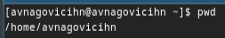{#fig:001 width=70%}

## Изучение команд pwd, ls.

Перехожу в каталог /tmp. И просто вывожу на экран содержимое каталога

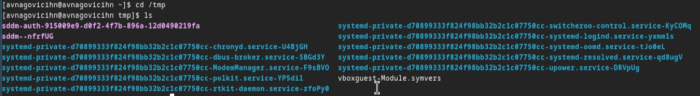{#fig:002 width=70%}

## Изучение команд pwd, ls.

Вывожу на экран содержимое каталога, права доступа, дату и время создания 

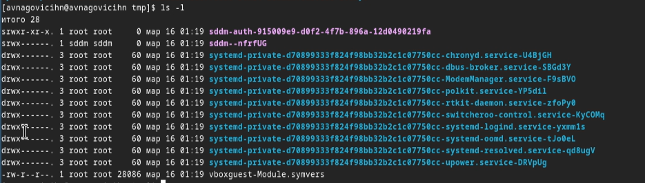{#fig:003 width=70%}

## Изучение команд pwd, ls.

Вывожу на экран ВСЁ содержимое каталога. Даже скрытые файлы

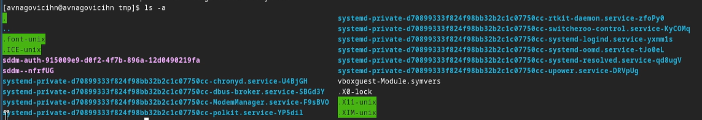{#fig:004 width=70%}

## Изучение команд pwd, ls.

После чего перехожу в каталог /var/spool/ и проверяю есть ли подкаталог с именем сron. Подкаталог с таким названием существует

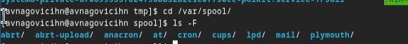{#fig:005 width=70%}

## Изучение команд pwd, ls.

Далее перехожу в домашний каталог и вывожу на экран всё содержимое каталога, определяя кто является владельцем файлов и подкаталогов 

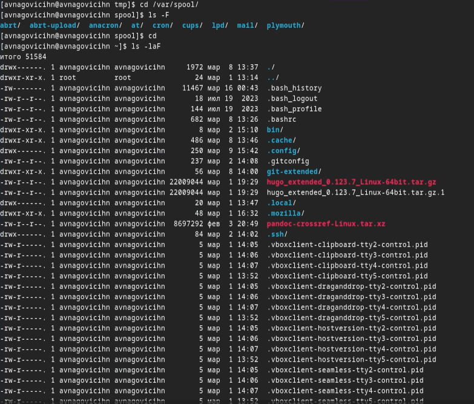{#fig:006 width=70%}

## Изучение команд mkdir, rm, rmdir.

Создаю каталог и проверяю правильность выполнения команды 

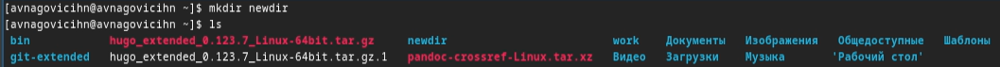{#fig:007 width=70%}

## Изучение команд mkdir, rm, rmdir.

Создаю подкаталог в каталоге newdir и проверяю правильность выполнения команды 

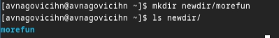{#fig:008 width=70%}

## Изучение команд mkdir, rm, rmdir.

Создаю 3 каталога. Проверяю правильность выполнения команды. После чего удаляю эти каталоги при помощи команды rmdir 

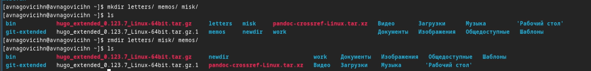{#fig:009 width=70%}

## Изучение команд mkdir, rm, rmdir.

Пробую удалить ранее созданный каталог newdir командой. После чего, при помощи ключа -r, удаляю дерево каталогов рекурентно 

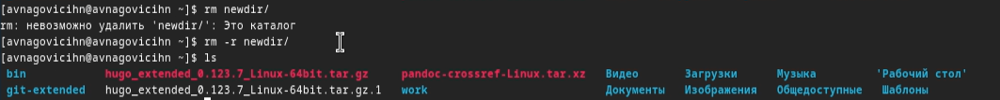{#fig:010 width=70%}

## Изучение команды man.

С помощью команды man и команды grep с ключом -B 2 (Ключ расшифровывается как Before. Ключ выводит строчку с найденным шаблоном и ещё 2 строчки сверху) 

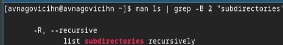{#fig:011 width=70%}

## Изучение команды man.

С помощью команды man определяю набор опций команды ls, позволяющий отсорти-
ровать по времени последнего изменения выводимый список содержимого каталога
с развёрнутым описанием файлов 

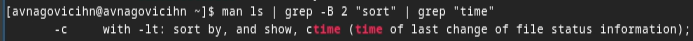{#fig:012 width=70%}

## Изучение команды man.

Используя команду man узнаю опции команды cd

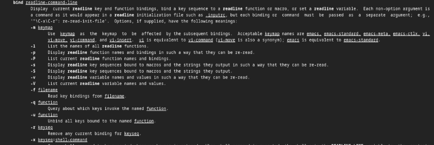{#fig:013 width=70%}

## Основные опции команды cd

Основные опции команды cd:
* cd .. - Возвращает из подкаталога в каталог.
* cd -e - Позволяет выйти с ошибкой если указанный каталог не существует.

## Изучение команды man

Используя команду man узнаю опции команды pwd

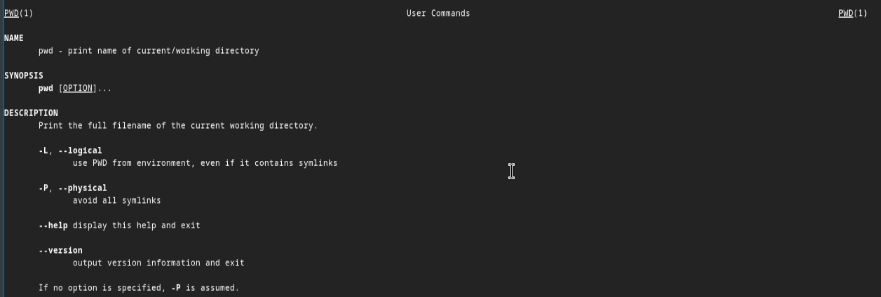{#fig:014 width=70%}

## Основные опции команды pwd

Основные опции команды pwd:

* pwd -P - Отбрасывать все символические ссылки
* pwd -L - Берет директорию из переменной окружения, даже если директория имеет символические ссылки.

## Изучение команды man

Используя команду man узнаю опции команды mkdir

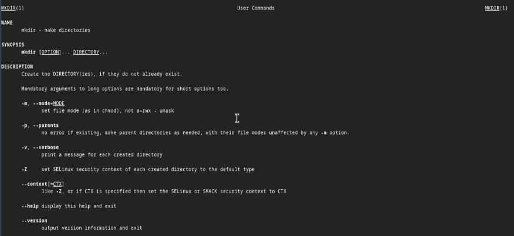{#fig:015 width=70%}

## Основные опции команды mkdir

Основные опции команды mkdir:

* mkdir -m - Устанавливает права доступа создаваемой директории, как chmod.
* mkdir -p - Позволяет рекурсивно создавать каталоги.
* mkdir -v - Выводит сообщения о созданных директориях.

## Изучение команды man

Используя команду man узнаю опции команды rmdir

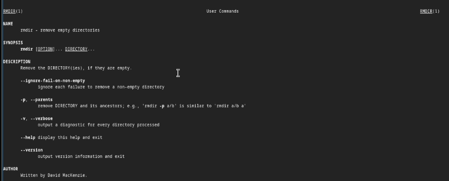{#fig:016 width=70%}

## Основные опции команды rmdir:

Основные опции команды rmdir

* rmdir -p - Позволяет рекурсивно удалять каталоги.
* rmdir -v - Выводит сообщения об удаленных директориях.

## Изучение команды man

Используя команду man узнаю опции команды rm 

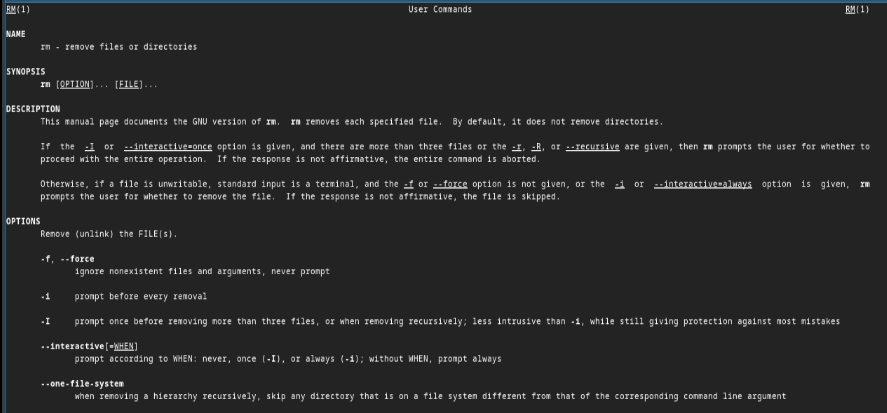{#fig:017 width=70%}

## Основные опции команды rm

Основные опции команды rm:

* rm -d - Позволяет удалять пустые каталоги.
* rm -r - Позволяет рекурсивно дерево каталогов.
* rm -i - Перед удалением каждого файла запрашивает подтверждение.
* rm -i - Перед удалением файлов запрашивает подтверждение только 1 раз.

## Изучение команды history.

Модернизирую команду так, чтобы она вывела все содержимое, даже скрытые файлы 

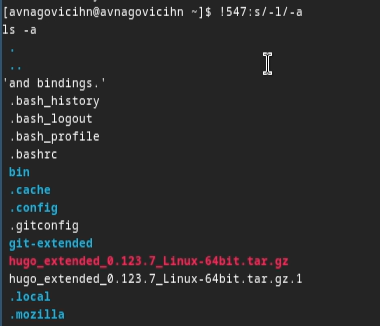{#fig:018 width=70%}

## Изучение команды history.

Модернизирую команду так, чтобы она создала каталог imsohappy. После чего проверяю правильность выполнения команды 

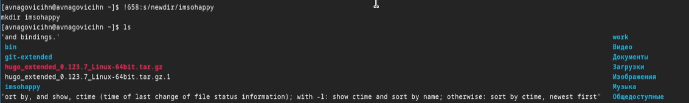{#fig:019 width=70%}

## Изучение команды history.

Модернизирую команду так, чтобы она удалил каталог imsohappy. После чего проверяю правильность выполнения команды 

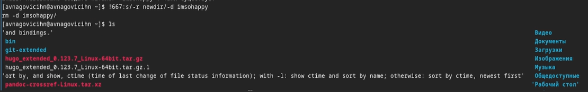{#fig:019 width=70%}

# Выводы

При выполнение данной лабораторной работы я приобрел практические навыки взаимодействия пользователя с системой посредством командной строки.
