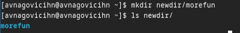

---
## Front matter
title: "Лабораторная работа №6"
subtitle: "Операционные системы"
author: "Наговицын Арсений Владимирович"

## Generic otions
lang: ru-RU
toc-title: "Содержание"

## Bibliography
bibliography: bib/cite.bib
csl: pandoc/csl/gost-r-7-0-5-2008-numeric.csl

## Pdf output format
toc: true # Table of contents
toc-depth: 2
lof: true # List of figures
lot: true # List of tables
fontsize: 12pt
linestretch: 1.5
papersize: a4
documentclass: scrreprt
## I18n polyglossia
polyglossia-lang:
  name: russian
  options:
	- spelling=modern
	- babelshorthands=true
polyglossia-otherlangs:
  name: english
## I18n babel
babel-lang: russian
babel-otherlangs: english
## Fonts
mainfont: PT Serif
romanfont: PT Serif
sansfont: PT Sans
monofont: PT Mono
mainfontoptions: Ligatures=TeX
romanfontoptions: Ligatures=TeX
sansfontoptions: Ligatures=TeX,Scale=MatchLowercase
monofontoptions: Scale=MatchLowercase,Scale=0.9
## Biblatex
biblatex: true
biblio-style: "gost-numeric"
biblatexoptions:
  - parentracker=true
  - backend=biber
  - hyperref=auto
  - language=auto
  - autolang=other*
  - citestyle=gost-numeric
## Pandoc-crossref LaTeX customization
figureTitle: "Рис."
tableTitle: "Таблица"
listingTitle: "Листинг"
lofTitle: "Список иллюстраций"
lotTitle: "Список таблиц"
lolTitle: "Листинги"
## Misc options
indent: true
header-includes:
  - \usepackage{indentfirst}
  - \usepackage{float} # keep figures where there are in the text
  - \floatplacement{figure}{H} # keep figures where there are in the text
---

# Цель работы

Целью лабораторной работы является приобретение практических навыков взаимодействия пользователя с системой посредством командной строки.

# Задание

1. Изучение команд pwd, ls.
2. Изучение команд mkdir, rm, rmdir.
3. Изучение команды man.
4. Изучение команды history.

# Выполнение лабораторной работы

## Изучение команд pwd, ls.

При помощи команды pwd, узнаю полное имя моего домашнего каталога (рис. @fig:001).

{#fig:001 width=70%}

Перехожу в каталог /tmp. И просто вывожу на экран содержимое каталога (рис. @fig:002).

{#fig:002 width=70%}

Вывожу на экран содержимое каталога, права доступа, дату и время создания (рис. @fig:003).

{#fig:003 width=70%}

Вывожу на экран ВСЁ содержимое каталога. Даже скрытые файлы (рис. @fig:004).

{#fig:004 width=70%}

После чего перехожу в каталог /var/spool/ и проверяю есть ли подкаталог с именем сron. Подкаталог с таким названием существует (рис. @fig:005).

{#fig:005 width=70%}

Далее перехожу в домашний каталог и вывожу на экран всё содержимое каталога, определяя кто является владельцем файлов и подкаталогов (рис. @fig:006).

{#fig:006 width=70%}

## Изучение команд mkdir, rm, rmdir.

Создаю каталог и проверяю правильность выполнения команды (рис. @fig:007).

{#fig:007 width=70%}

Создаю подкаталог в каталоге newdir и проверяю правильность выполнения команды (рис. @fig:008).

{#fig:008 width=70%}

Создаю 3 каталога. Проверяю правильность выполнения команды. После чего удаляю эти каталоги при помощи команды rmdir (рис. @fig:009).

{#fig:009 width=70%}

Пробую удалить ранее созданный каталог newdir командой. После чего, при помощи ключа -r, удаляю дерево каталогов рекурентно (рис. @fig:010).

{#fig:010 width=70%}

## Изучение команды man.

С помощью команды man и команды grep с ключом -B 2 (Ключ расшифровывается как Before. Ключ выводит строчку с найденным шаблоном и ещё 2 строчки сверху) (рис. @fig:011).

{#fig:011 width=70%}

С помощью команды man определяю набор опций команды ls, позволяющий отсорти-
ровать по времени последнего изменения выводимый список содержимого каталога
с развёрнутым описанием файлов (рис. @fig:012).

{#fig:012 width=70%}

Используя команду man узнаю опции команды cd(рис. @fig:013).

{#fig:013 width=70%}

Основные опции команды cd:
* cd .. - Возвращает из подкаталога в каталог.
* cd -e - Позволяет выйти с ошибкой если указанный каталог не существует.

Используя команду man узнаю опции команды pwd(рис. @fig:014).

{#fig:014 width=70%}

Основные опции команды pwd:

* pwd -P - Отбрасывать все символические ссылки
* pwd -L - Берет директорию из переменной окружения, даже если директория имеет символические ссылки.

Используя команду man узнаю опции команды mkdir(рис. @fig:015).

{#fig:015 width=70%}

Основные опции команды mkdir:

* mkdir -m - Устанавливает права доступа создаваемой директории, как chmod.
* mkdir -p - Позволяет рекурсивно создавать каталоги.
* mkdir -v - Выводит сообщения о созданных директориях.

Используя команду man узнаю опции команды rmdir(рис. @fig:016).

{#fig:016 width=70%}

Основные опции команды rmdir:

* mkdir -p - Позволяет рекурсивно удалять каталоги.
* mkdir -v - Выводит сообщения об удаленных директориях.

Используя команду man узнаю опции команды rm (рис. @fig:017).

{#fig:017 width=70%}

Основные опции команды rm:

* rm -d - Позволяет удалять пустые каталоги.
* rm -r - Позволяет рекурсивно дерево каталогов.
* rm -i - Перед удалением каждого файла запрашивает подтверждение.
* rm -i - Перед удалением файлов запрашивает подтверждение только 1 раз.

## Изучение команды history.

Модернизирую команду так, чтобы она вывела все содержимое, даже скрытые файлы (рис. @fig:018).

{#fig:018 width=70%}

Модернизирую команду так, чтобы она создала каталог imsohappy. После чего проверяю правильность выполнения команды (рис. @fig:019).

{#fig:019 width=70%}

Модернизирую команду так, чтобы она удалил каталог imsohappy. После чего проверяю правильность выполнения команды (рис. @fig:019).

{#fig:019 width=70%}

# Выводы

При выполнение данной лабораторной работы я приобрел практические навыки взаимодействия пользователя с системой посредством командной строки.

# Ответы на контрольные вопросы

1. Командная строка – это текстовый интерфейс между человеком и компьютером,
в котором инструкции компьютеру даются путём ввода с клавиатуры текстовых строк.

2. Для просмотра абсолютного пути текущего каталога можно использовать команду pwd. Например, если мы находимся в домашнем каталоге, то мы можем узнать абсолютный его путь прописав pwd: /home/avnagovicihn

3. С помощью команды ls можно определить имена файлов, при помощи
опции -F уже мы сможем определить тип файлов, если нам необходимы
скрытые файлы, добавим опцию -a. Пример есть в лабораторной работе.

4. С помощью команды ls можно определить имена файлов, если нам необходимы скрытые файлы, добавим опцию -a. Пример есть в лабораторной
работе.

5. rmdir по умолчанию удаляет пустые каталоги, не удаляет файлы. rm удаляет файлы, без дополнительных опций (-d, -r) не будет удалять каталоги.Если файл
находится в каталоге, используем рекурсивное удаление, если файл и каталог не связаны подобным образом, то добавим опцию -d, введя имена через пробел после утилиты.

6. Вывести информацию о последних выполненных пользователем команд
можно с помощью history. Пример приведен в лабораторной работе.

7. Используем синтаксис !номеркоманды в выводе history:s/что заменяем/на
20 что заменяем Примеры приведены в лабораторной работе.

8. Предположим, я нахожусь не в домашнем каталоге. Если я введу “cd ; ls”, то
окажусь в домашнем каталоге и получу вывод файлов внутри него.

9. Символ экранирования - (обратный слеш) добавление перед спецсимволом
обратный слеш, чтобы использовать специальный символ как обычный.
Также позволяет читать системе название директорий с пробелом. Пример:
cd work/Операционные системы/

10. Опция -l позволит увидеть дополнительную информацию о файлах в каталоге: время создания, владельца, права доступа

11. Относительный путь к файлу начинается из той директории, где вы находитесь (она сама не прописывается в пути), он прописывается относительно
данной директории. Абсолютный путь начинается с корневого каталога.

12. Использовать man или –help

13. Клавиша Tab.
